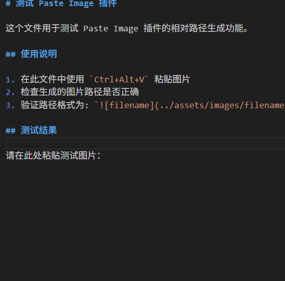

# Unity 入门指南
## 什么是 Unity？

Unity 是一款跨平台的游戏开发引擎，由 Unity Technologies 开发。它以易用性、强大的跨平台能力和丰富的功能著称，是世界上最受欢迎的游戏引擎之一。

## 为什么选择 Unity？

### 优势
- **跨平台支持** - 一次开发，多平台发布
- **易学易用** - 友好的用户界面和工作流程
- **强大的社区** - 大量教程、插件和资源
- **免费版本** - 个人和小团队免费使用
- **脚本语言** - 支持 C# 编程
- **可视化编辑** - 直观的场景编辑器

### 应用平台
- **移动平台** - iOS、Android
- **桌面平台** - Windows、macOS、Linux
- **主机平台** - PlayStation、Xbox、Nintendo Switch
- **Web 平台** - WebGL
- **VR/AR** - Oculus、HTC Vive、HoloLens

## 系统要求

### 最低配置
- **操作系统**: Windows 10 64位 / macOS 10.13+
- **处理器**: SSE2 指令集支持
- **内存**: 4 GB RAM
- **显卡**: DirectX 11 兼容显卡
- **存储**: 8 GB 可用空间

### 推荐配置
- **操作系统**: Windows 11 64位 / macOS 12+
- **处理器**: Intel i5 / AMD Ryzen 5
- **内存**: 16 GB RAM
- **显卡**: 独立显卡（GTX 1060 或同级别）
- **存储**: 20 GB 可用空间（SSD 推荐）

## 安装步骤

### 1. 下载 Unity Hub
1. 访问 [Unity 官网](https://unity.com/)
2. 点击 "开始使用 Unity"
3. 下载 Unity Hub
4. 安装 Unity Hub

### 2. 创建 Unity ID
1. 在 Unity Hub 中点击 "登录"
2. 创建新的 Unity ID
3. 选择个人许可证（免费）

### 3. 安装 Unity 编辑器
1. 在 Unity Hub 中点击 "安装"
2. 选择 Unity 版本（推荐 LTS 版本）
3. 选择模块（Android、iOS 等）
4. 开始安装

### 4. 创建项目
1. 在 Unity Hub 中点击 "新建项目"
2. 选择模板（2D、3D、VR 等）
3. 设置项目名称和保存位置
4. 点击 "创建项目"

## 界面介绍

### 主要窗口
- **场景视图 (Scene View)** - 3D 场景编辑
- **游戏视图 (Game View)** - 游戏预览
- **层级视图 (Hierarchy)** - 场景对象层次结构
- **项目视图 (Project)** - 项目资源管理
- **检视面板 (Inspector)** - 对象属性编辑
- **控制台 (Console)** - 日志和错误信息

### 重要概念
- **场景 (Scene)** - 游戏的一个关卡或界面
- **游戏对象 (GameObject)** - 场景中的基本单位
- **组件 (Component)** - 游戏对象的功能模块
- **预制体 (Prefab)** - 可重用的游戏对象模板
- **脚本 (Script)** - 控制游戏逻辑的代码

## 第一个项目

### 创建简单场景
1. **添加基本对象**
   - 右键点击 Hierarchy -> 3D Object -> Cube
   - 创建一个立方体对象
   - 调整位置和大小

2. **设置相机**
   - 选择 Main Camera
   - 调整相机位置和角度
   - 设置背景颜色

3. **添加光源**
   - 右键点击 Hierarchy -> Light -> Directional Light
   - 调整光源方向和强度

### 添加脚本
1. **创建脚本**
   - 在 Project 窗口右键 -> Create -> C# Script
   - 命名为 "CubeRotator"
   - 双击打开脚本编辑器

2. **编写代码**
   ```csharp
   using UnityEngine;
   
   public class CubeRotator : MonoBehaviour
   {
       void Update()
       {
           transform.Rotate(0, 90 * Time.deltaTime, 0);
       }
   }
   ```

3. **应用脚本**
   - 将脚本拖拽到 Cube 对象上
   - 点击播放按钮测试效果

### 基本操作
- **移动视角**: 鼠标右键 + WASD
- **缩放**: 鼠标滚轮
- **平移**: 鼠标中键拖拽
- **选择对象**: 鼠标左键点击
- **多选**: Ctrl + 鼠标左键

## C# 脚本基础

### 基本结构
```csharp
using UnityEngine;

public class MyScript : MonoBehaviour
{
    // 变量声明
    public float speed = 5.0f;
    private int score = 0;
    
    // 初始化
    void Start()
    {
        // 游戏开始时执行一次
    }
    
    // 每帧更新
    void Update()
    {
        // 每帧都会执行
    }
}
```

### 常用方法
- **Start()** - 对象创建时调用
- **Update()** - 每帧调用
- **FixedUpdate()** - 固定时间间隔调用
- **OnCollisionEnter()** - 碰撞检测
- **OnTriggerEnter()** - 触发器检测

### 常用组件
- **Transform** - 位置、旋转、缩放
- **Rigidbody** - 物理组件
- **Collider** - 碰撞体
- **Renderer** - 渲染组件
- **AudioSource** - 音频组件

## 常见功能实现

### 角色移动
```csharp
public class PlayerController : MonoBehaviour
{
    public float moveSpeed = 5f;
    
    void Update()
    {
        float horizontal = Input.GetAxis("Horizontal");
        float vertical = Input.GetAxis("Vertical");
        
        Vector3 movement = new Vector3(horizontal, 0, vertical);
        transform.Translate(movement * moveSpeed * Time.deltaTime);
    }
}
```

### 跳跃功能
```csharp
public class JumpController : MonoBehaviour
{
    public float jumpForce = 10f;
    private Rigidbody rb;
    private bool isGrounded = true;
    
    void Start()
    {
        rb = GetComponent<Rigidbody>();
    }
    
    void Update()
    {
        if (Input.GetKeyDown(KeyCode.Space) && isGrounded)
        {
            rb.AddForce(Vector3.up * jumpForce, ForceMode.Impulse);
            isGrounded = false;
        }
    }
    
    void OnCollisionEnter(Collision collision)
    {
        if (collision.gameObject.CompareTag("Ground"))
        {
            isGrounded = true;
        }
    }
}
```

## 学习资源

### 官方资源
- [Unity 官方文档](https://docs.unity3d.com/cn/)
- [Unity Learn](https://learn.unity.com/) - 官方教程平台
- [Unity Asset Store](https://assetstore.unity.com/) - 资源商店

### 社区资源
- [Unity 中文社区](https://unity.cn/)
- [Unity 论坛](https://forum.unity.com/)
- [YouTube 教程](https://www.youtube.com/c/Unity)

### 推荐教程
- **新手教程** - Roll-a-Ball 教程
- **2D 教程** - 2D 平台跳跃游戏
- **3D 教程** - 第三人称角色控制

### 推荐书籍
- 《Unity 游戏开发入门》
- 《Unity 5.x 游戏开发实例》
- 《Unity 着色器和屏幕特效开发》

## 常见问题

### Q: Unity 版本该如何选择？
A: 建议选择 LTS (Long Term Support) 版本，更加稳定，适合长期项目开发。

### Q: 免费版和付费版的区别？
A: 免费版功能已经非常完整，只有在年收入超过 $100,000 时才需要付费版本。

### Q: 如何提高 Unity 项目性能？
A: 
- 合理使用对象池
- 减少 Update 方法中的计算
- 优化贴图和模型
- 使用 Profiler 分析性能

### Q: C# 基础不好怎么办？
A: 可以先学习 C# 基础语法，推荐查看我们的 [C# 基础教程](../编程基础/CSharp.md)。

## 下一步

完成入门学习后，可以继续学习：
- [Unity 进阶](进阶.md) - 深入学习 Unity 高级功能
- [Unity 项目](项目.md) - 参与实际项目开发
- [C# 基础](../编程基础/CSharp.md) - 加强编程基础

---

*遇到问题？查看我们的 [项目信息](../项目信息/蜀祭·太初.md) 或联系社团成员*
